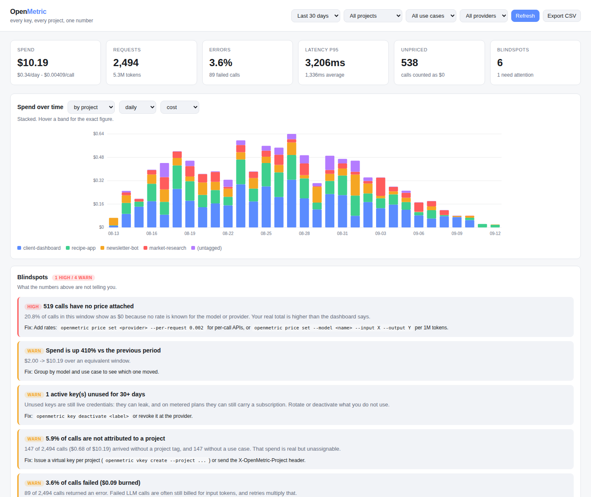
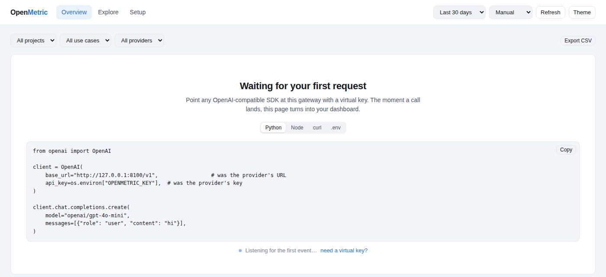

<div align="center">

# OpenMetric

**One gateway for every API key you use. Per-project cost visibility for people running more than one thing at once.**

[](https://github.com/uhkash/openmetric/actions/workflows/ci.yml)
[](LICENSE)
[](https://www.python.org/downloads/)

**[openmetric.vercel.app](https://openmetric.vercel.app)**

Self-hosted. Your keys and your usage data never leave your machine.



</div>

> **Would rather not run it yourself?** [OpenMetric Cloud](https://openmetric.vercel.app/#cloud) — the same gateway, hosted, with
> teams and alerts — is in early access. [Join the waitlist](https://github.com/uhkash/openmetric/issues/new?title=Cloud%20waitlist&labels=cloud-waitlist).
> The self-hosted version stays complete, MIT-licensed, and gate-free. [How that works →](docs/DISTRIBUTION.md)

<div align="center">

</div>

---

## The problem

You have four side projects, a client dashboard and a scraper. Between them you are using
two OpenRouter keys, an OpenAI key, something for scraping, something for search — and a
`.env` file per project that has quietly drifted out of sync.

Then the bill arrives, and you cannot answer basic questions:

- Which project spent that $40?
- Is the summarisation feature or the chat feature the expensive one?
- I have three OpenRouter keys — is one of them doing nothing?
- I stopped working on that project in March. Is it still calling anything?

Provider dashboards cannot answer these, because a provider only sees its own key.
Nothing sees across all of them. OpenMetric is the thing in the middle that does.

## What it does

```
your app ──▶ OpenMetric ──▶ OpenRouter / OpenAI / Firecrawl / Serper / anything
                  │
                  └──▶ one local database: project, use case, provider, key, tokens, cost
```

- **One endpoint for everything.** OpenAI-compatible at `/v1`, plus a generic passthrough at
  `/proxy/{provider}/...` for scraping, search, or any other REST API.
- **Your app stops holding provider keys.** It holds an OpenMetric *virtual key*, which
  carries the project and use-case tags. Real keys stay encrypted on your machine.
- **Every call is priced.** Token counts from the response, multiplied by a rate catalog —
  or the provider's own reported cost when it gives one.
- **Slice it any way.** project × provider, use case × model, key × day. Same events,
  whichever angle the question needs. Click anything to drill into it.
- **Blindspots.** The part most dashboards skip: what your usage data is *wrong* about.

## Quickstart

```bash
git clone https://github.com/uhkash/openmetric.git
cd openmetric
pip install -e .

openmetric init            # generates an encryption key into .env (gitignored)
openmetric demo            # optional: synthetic data so the dashboard isn't empty
openmetric serve           # http://127.0.0.1:8099
```

`openmetric demo` generates entirely fake traffic and fake keys. It touches nothing real.
Wipe it whenever you like with `rm openmetric.db`.

Skip the demo and the dashboard opens on a first-run screen instead: a setup checklist,
a copy-paste snippet, and a listener that flips into the real dashboard the moment your
first request lands. Projects, provider keys and virtual keys can all be created from the
**Setup** tab — the CLI is optional.



### Point a real project at it

```bash
# 1. Store a provider key. It is prompted for, never passed as an argument,
#    so it never lands in your shell history.
openmetric key add openrouter --label openrouter-personal
#    ...or read it straight out of your environment:
OPENROUTER_API_KEY=... openmetric key add openrouter --label personal --from-env OPENROUTER_API_KEY

# 2. Issue a virtual key for one project.
openmetric vkey create --name recipe-app --project recipe-app --use-case llm-summary
#    -> om_live_xxxxxxxxxxxxxxxxxxxxxxxx   (shown once)
```

Then change two lines in your app:

```diff
  client = OpenAI(
-     base_url="https://openrouter.ai/api/v1",
-     api_key=os.environ["OPENROUTER_API_KEY"],
+     base_url="http://localhost:8099/v1",
+     api_key=os.environ["OPENMETRIC_KEY"],
  )
```

That is the whole integration. Every call is now tagged, measured and priced.

## The model

Four things, and the relationships between them are the entire point:

| | |
|---|---|
| **Project** | the thing you are building — `recipe-app`, `client-dashboard` |
| **Use case** | what the call is *for* — `llm-summary`, `scraping`, `embeddings` |
| **Provider** | who you buy from — `openrouter`, `openai`, `firecrawl` |
| **Credential** | which key paid for it — you can have several per provider |

One OpenRouter account, three keys, four projects, six use cases is a normal setup and
OpenMetric expects it. A virtual key pins a project; headers override per call:

```bash
curl http://localhost:8099/v1/chat/completions \
  -H "Authorization: Bearer $OPENMETRIC_KEY" \
  -H "X-OpenMetric-Project: client-dashboard" \
  -H "X-OpenMetric-Use-Case: classification" \
  -H "Content-Type: application/json" \
  -d '{"model":"openai/gpt-4o-mini","messages":[{"role":"user","content":"hi"}]}'
```

Projects and use cases are created on first sight, so you can add a tag mid-build without
stopping to configure anything.

### Non-LLM APIs

Scrapers, search APIs and everything else go through the generic route, and are measured
in requests instead of tokens:

```bash
curl http://localhost:8099/proxy/firecrawl/v1/scrape \
  -H "Authorization: Bearer $OPENMETRIC_KEY" \
  -H "X-OpenMetric-Project: market-research" \
  -H "X-OpenMetric-Use-Case: web-scraping" \
  -d '{"url":"https://example.com"}'
```

Credit-based plans differ per account, so tell OpenMetric your effective rate once:

```bash
openmetric price set firecrawl --per-request 0.002
```

Until you do, those calls are counted but reported as **unpriced** rather than quietly
added up as $0. See below.

## The dashboard

Three views, one filter row that scopes all of them, and a URL that carries the whole
state so any view is a link you can send yourself later.

- **Overview** — spend, requests, error rate, p95 latency, each with a delta against the
  previous period; spend over time stacked by any dimension with one tooltip listing
  every series; blindspots; budgets.
- **Explore** — the breakdown table and the cross-tab. Click a row or a cell and
  everything filters to it. Model and key filters show as removable chips.
- **Setup** — checklist, connection snippets in four languages, and forms for projects,
  provider keys and virtual keys.

It is plain HTML, CSS and JavaScript with no build step and no CDN, so it works offline
and can be read in an afternoon. The colour palette is validated for colour-vision
deficiency in both light and dark mode, and every chart has a table twin.

## Blindspots

A usage dashboard tells you what you spent. This tells you what the number is missing.

| Check | What it catches |
|---|---|
| **Untagged traffic** | spend that arrived with no project — real money, unassignable |
| **Unpriced spend** | calls shown as $0 because no rate is known. Your true total is higher |
| **Error burn** | money spent on failed calls (input tokens are usually still billed) |
| **Idle keys** | active credentials unused for 30+ days — a leak risk and often a live subscription |
| **Shared keys** | one key serving several projects, so the provider's invoice can never be split |
| **Budget overruns** | month-to-date spend past a limit you set |
| **Spend trend** | this period against the previous one, when it moves more than 50% |
| **Concentration** | one provider carrying almost everything |
| **Dormant projects** | configured, but silent — finished, or quietly broken? |
| **Latency tail** | a p95 far above the mean, which usually means retries or rate limits |

```bash
openmetric blindspots
```

Every finding carries its evidence and the command that fixes it. Nothing here is a vibe.

## Reporting from the terminal

```bash
openmetric report --by project          # where the money went
openmetric report --by use_case         # which feature is expensive
openmetric report --by credential       # which key is actually being used
openmetric report --by model --days 7
openmetric report --by provider --project client-dashboard
openmetric export --out spend.csv       # no keys, no prompt text
```

## Security

This is a tool that holds every API key you own, published as a public repo. The design
takes that seriously:

- **Keys are encrypted at rest** (Fernet/AES-128-CBC + HMAC). The encryption key lives in
  `.env`, which is gitignored and written `chmod 600` — never in the database, never in the repo.
- **No endpoint returns a key.** The API exposes a hint (`sk-or...9f2a`) and a non-reversible
  fingerprint. There is a [test](tests/test_security.py) that walks every read endpoint and
  fails if a stored key appears in any response.
- **No key in your shell history.** `openmetric key add` prompts with hidden input or reads
  an environment variable. There is no `--api-key` flag to accidentally leave in `.bash_history`.
- **Virtual keys are stored hashed.** A copied database does not let anyone use your gateway.
- **Prompts and responses are not stored** unless you explicitly opt in, and even then
  anything key-shaped is redacted first.
- **Errors and logs are scrubbed** of ten-plus vendor key formats before they are written
  or returned, so pasting a stack trace into an issue is safe.
- **Secret scanning in CI** via gitleaks, plus tests that fail if `.env` or a `.db` file is
  ever staged.

Full detail, and how to report a vulnerability: [SECURITY.md](SECURITY.md).

**Running it beyond localhost?** Set `OPENMETRIC_ADMIN_TOKEN`. Without one, anyone who can
reach the port can spend your money.

## Configuration

Everything is environment variables — see [.env.example](.env.example).

| Variable | Default | Purpose |
|---|---|---|
| `OPENMETRIC_SECRET_KEY` | — | Encryption key for credentials. Generated by `openmetric init` |
| `OPENMETRIC_DATABASE_URL` | `sqlite:///./openmetric.db` | SQLite or Postgres |
| `OPENMETRIC_ADMIN_TOKEN` | empty | Required for the API when set. Set it if you bind publicly |
| `OPENMETRIC_LOG_REQUEST_BODIES` | `false` | Store prompt text. Off for a reason |
| `OPENMETRIC_LOG_RESPONSE_BODIES` | `false` | Store response text. Off for a reason |
| `OPENMETRIC_EVENT_RETENTION_DAYS` | `0` (forever) | Used by `openmetric prune` |

## Deploying

There are two deployable things here, and they go to different places:

| What | Where | How |
|---|---|---|
| **The gateway** (`src/openmetric`) | Your laptop, Docker, Render, Railway, Fly — anywhere with a disk and a long-lived process | `docker compose up -d`, or the one-click [`render.yaml`](render.yaml) |
| **The website** (`site/`) | Vercel — live at [openmetric.vercel.app](https://openmetric.vercel.app) | `vercel` from the repo root; [`vercel.json`](vercel.json) points at `site/`. Pushes to `main` redeploy it |

The gateway is a streaming proxy with a SQLite file. It does not belong on serverless
functions: they have no persistent disk and cut long streaming responses off. If you
expose it beyond localhost, set `OPENMETRIC_ADMIN_TOKEN`.

```bash
cp .env.example .env          # then fill in OPENMETRIC_SECRET_KEY
docker compose up -d
```

Releases: tag `vX.Y.Z` and the [`Release`](.github/workflows/release.yml) workflow
publishes to PyPI (via trusted publishing) and creates a GitHub release.

## Providers: the catalog is a convenience, not a limit

Fifteen providers ship configured — `openrouter`, `openai`, `anthropic`, `groq`,
`deepseek`, `mistral`, `together`, `perplexity`, `firecrawl`, `serper`, `tavily`, `exa`,
`scrapingbee`, `apify`, `resend` — so those work with nothing but a key.

**Everything else works too.** The gateway is a generic HTTP proxy; the catalog only
supplies defaults. Any REST API you pay for can be added in one command and is measured
from the first call:

```bash
openmetric provider add weatherapi \
  --base-url https://api.weatherapi.com/v1 \
  --kind other \
  --auth-style query --auth-query-param key      # ?key=... instead of a header

openmetric key add weatherapi --label weather-main
openmetric price set weatherapi --per-request 0.004
```

Then call it exactly as you would have, through `/proxy/weatherapi/...`:

```bash
curl -X POST http://localhost:8099/proxy/weatherapi/forecast.json \
  -H "Authorization: Bearer $OPENMETRIC_KEY" \
  -H "X-OpenMetric-Project: trip-planner" \
  -H "X-OpenMetric-Use-Case: forecasts"
```

GET, POST, PUT, PATCH and DELETE all pass through, with the path, query string and body
untouched. Four auth styles cover almost everything:

| `--auth-style` | What the gateway sends |
|---|---|
| `bearer` (default) | `Authorization: Bearer <key>` |
| `header` | a header you name, e.g. `--auth-header X-API-KEY` |
| `query` | a query parameter you name, e.g. `--auth-query-param api_key` |
| `basic` | `Authorization: Basic <key>` |

### What it will not do (yet)

Be aware of these before assuming an API fits:

- **Auth schemes beyond those four.** OAuth2 with a refresh-token dance, AWS SigV4, or
  per-request HMAC signing need code, not configuration. A static secret in a header,
  query parameter or bearer token is the supported shape.
- **Pricing shapes other than per-token and per-unit.** Per-byte, per-compute-second and
  tiered or committed-use pricing cannot be expressed. Anything unpriceable is reported
  as *unpriced* rather than guessed at.
- **Token counts from an unfamiliar LLM response shape.** OpenAI, Anthropic and Gemini
  shapes are parsed; a novel one needs a few lines in
  [`usage.py`](src/openmetric/usage.py) (and a PR would be welcome).
- **Non-HTTP protocols.** gRPC, WebSockets and SDKs that do not speak plain HTTP are out
  of scope.

For a non-LLM API, one call counts as one billing unit unless the response contains a
`results`, `data`, `organic` or `items` array — then each entry counts, which matches how
most search and scraping APIs actually bill.

## How pricing works

1. **Upstream** — the provider told us the cost (OpenRouter does). Always preferred.
2. **Catalog** — token counts × a rate from [`catalog.yaml`](src/openmetric/data/catalog.yaml).
3. **Unknown** — we could not price it, so it is reported as unpriced instead of counted as zero.

Rates drift. Override them in `pricing.local.yaml` without touching the built-in catalog:

```bash
openmetric price set --model my-org/custom-model --input 0.5 --output 1.5
openmetric price show anthropic/claude-sonnet-4
```

## Development

```bash
pip install -e ".[dev]"
pytest                  # 90+ tests, no network access needed
ruff check .
```

Contributions welcome — especially catalog price updates and new provider definitions,
which are a one-file change. See [CONTRIBUTING.md](CONTRIBUTING.md).

## How this compares

The problem is real and well served for LLM traffic: LiteLLM has virtual keys and spend
per tag, Helicone had 16,000 organisations on "change one line, see your costs", and
providers now ship per-key spend themselves. OpenMetric's slot is narrower than any of
them: one person or a small team, several projects, several providers *including the
non-LLM ones*, self-hosted in one command with no Postgres, and a dashboard that reports
what its own numbers are missing.

If everything you run goes through one OpenRouter account with one key per project, that
provider's dashboard may already be enough for you. The full, sourced comparison — what
each tool does, where it stops, and what would make this project unnecessary — is in
[docs/POSITIONING.md](docs/POSITIONING.md).

## Why is this free, and how does it make money?

Because the people it is for — one builder, several projects — are exactly the people who
should not have to pay to see their own spend. The self-hosted gateway is the whole
product with no gates. Revenue comes from a hosted version for people who would rather
not run it, and from team features that only make sense with a server: shared projects,
SSO, alerts, reconciliation. Nothing in this repo phones home, and nothing in it will be
removed to sell it back to you. The full plan is in [docs/DISTRIBUTION.md](docs/DISTRIBUTION.md).

## What this is not

- Not a hosted service. There is no account, no telemetry, nothing phones home.
- Not a load balancer or a failover router. It measures; it does not decide.
- Not a billing system of record. Your provider's invoice is the truth; this tells you
  how to split it.

## License

MIT. See [LICENSE](LICENSE).
